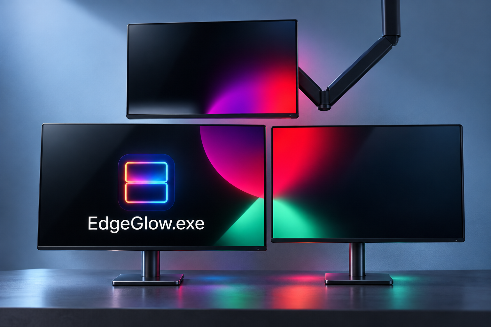
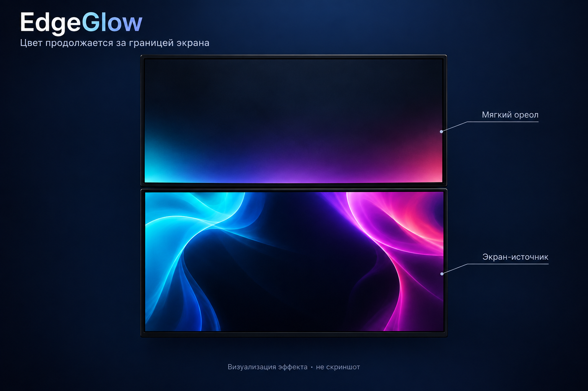

<p align="center">
  
</p>

<h1 align="center">EdgeGlow</h1>
<p align="center">Мягкий свет между экранами · Windows 11 · локальный захват · portable</p>

EdgeGlow переносит цвета с края одного монитора в прозрачный ореол на соседнем. Если источник снизу, свечение появляется у нижнего края верхнего экрана и плавно исчезает вверх. Обои остаются видимыми, а цвета сохраняют своё положение вдоль стыка.

**English:** EdgeGlow is a Windows desktop app that casts a translucent, edge-matched ambient glow onto adjacent monitors. Includes GPU edge sampling, configurable capture rates, click-through overlays and a low-power preset. Russian settings UI. SDR only.

**Статус: ранняя версия 0.1.0.** Основной сценарий проверен на реальных экранах; список ограничений и оставшихся проверок — ниже.

## Быстрый старт



*Иллюстрация работы, предоставленная автором проекта. Цветной ореол создаётся внутри экрана; физическая подсветка стола и стены в иллюстрации не является функцией приложения.*



*Визуализация эффекта: нижний экран — источник, верхний — получатель. Это иллюстрация, а не реальный скриншот. Вид и яркость зависят от настроек и расположения экранов.*

1. Скачайте `EdgeGlow-portable-win-x64.zip` из **Releases**, когда владелец репозитория опубликует релиз.
2. Распакуйте архив целиком и запустите `EdgeGlow.exe`. Установка .NET и права администратора не нужны.
3. Выберите источник и соседние получатели на вкладке **Экраны**.
4. Нажмите **Тест без захвата**, затем **Включить** для реального изображения.

В стандартном режиме рабочего стола освободите область ореола от окон: пересекающее её обычное окно скрывает эффект всего получателя. Для свечения поверх приложений есть отдельный режим **«Поверх всех окон»**.

## Возможности

- Получатели сверху, снизу, слева и справа; частичный стык, смещение и отрицательные координаты.
- Закреплённый источник, следование за активным окном или переключение монитора щелчком. Одно наведение мыши не переключает источник.
- Прозрачное окно без рамки, активации и перехвата мыши. Рабочий стол не подменяется снимком.
- Захват 1/2/5/10/15/30/60 раз в секунду и независимый предел плавного обновления 15/30/60.
- Разрешение выборки 32/64/128/256 цветовых точек на край.
- Щадящий режим: 5 захватов/с, 30 обновлений/с, 64 точки, переход 400 мс.
- Яркость, прозрачность, насыщенность, глубина, размытие, временное сглаживание; полное отключение фильтров.
- Ручная обрезка чёрных полос, сдвиг и масштаб соответствия стыка для каждой пары.
- Постоянная поверхность, SIMD-растеризация и неподвижный дизеринг для уменьшения полос градиента.
- Трей, горячие клавиши, сохранение настроек, кнопка сброса.

## Горячие клавиши

| По умолчанию | Действие |
|---|---|
| **Ctrl+Shift+F10** | Остановить эффект |
| **Ctrl+Shift+F9** | Переключить захват при перемещении окон |

Сочетания меняются на вкладке **Управление**. Если они заняты, приложение сообщает об ошибке. Закрытие настроек сворачивает их в трей; завершение программы — **Выход** в меню значка.

## Производительность и качество

Начните со **щадящего режима**. Более редкий захват экономит обработку источника, а временное сглаживание продолжает менять цвета между захватами. При отключённых фильтрах редкие кадры будут заметны как скачки — это ожидаемое поведение.

Разрешение выборки уменьшает размер GPU-обработки полосы, но не меняет разрешение Windows или исходную поверхность Desktop Duplication. Фактический FPS зависит от оборудования и планировщика; указанные значения — пределы, а не гарантия.

Захват при перетаскивании включён по умолчанию. Если появляются задержки, выключите опцию **«Продолжать захват при перемещении окон»** или нажмите Ctrl+Shift+F9. Тогда эффект при движении временно скрывается. Перекрытие в режиме рабочего стола — независимая причина скрытия.

## Ограничения

- **Windows 11 x64, SDR, Direct3D 11.** HDR-источник отклоняется; tone mapping не реализован. Корректность цвета на HDR-получателе не гарантируется.
- Режим рабочего стола использует скрытие при перекрытии; это не встраивание слоя между обоями и приложениями. WorkerW не используется.
- Смешивание — premultiplied alpha-over, не аддитивное. Светлые обои могут становиться темнее под цветным слоем.
- Финальная поверхность 8-битная; дизеринг уменьшает полосы, но внешний вид зависит от панели.
- Повороты и смешанный DPI предусмотрены в коде; полный набор физических конфигураций не проверен. Несколько GPU, сон, hot-plug, exclusive-игры и 4K/60 требуют дополнительной проверки.
- DRM и системные ограничения захвата не обходятся. Чёрное изображение само по себе не считается ошибкой.
- Имена DISPLAY могут меняться после установки драйвера: в этом случае повторно выберите экраны.

## Приватность

Все кадры обрабатываются локально и не отправляются в сеть. Обычный запуск не сохраняет кадры или диагностические логи. Отслеживание щелчков используется только для выбора монитора; история ввода не записывается.

Настройки: `%LOCALAPPDATA%\EdgeGlow\settings.json`. При запуске эффект выключен; автозапуска нет. Диагностические режимы включаются только аргументами и сохраняют текстовые метрики без изображения экрана.

## Сборка

Windows x64, PowerShell **7+** и .NET SDK **10.0.100**; допускается более свежий patch той же feature band согласно `global.json`.

```powershell
./build.ps1
# При наличии GPU и интерактивного Windows-сеанса:
./build.ps1 -GpuTests
# Создать ZIP для GitHub Releases:
./package.ps1
```

Результат сборки — `portable/`, архивы — `artifacts/`. Self-contained выпуск включает .NET Runtime **10.0.9**. Vortice **3.8.3**, остальные версии и хеши закреплены в `src/packages.lock.json`. Первой сборке нужен Интернет для зависимостей.

GitHub Actions выполняет сборку и CPU-тесты на Windows. GPU-тесты не запускаются на обычном облачном runner. Workflow сохраняет portable-архив как artifact; публичный Release автоматически не создаётся.

## Разработка

```powershell
dotnet run --project tests/EdgeGlow.Tests.csproj -c Release
dotnet run --project tests/EdgeGlow.Tests.csproj -c Release -- --gpu
```

- [Архитектура](docs/ARCHITECTURE.md)
- [Проверки и ограничения измерений](docs/TESTING.md)
- [Ручная приёмка](docs/MANUAL-TESTS.md)
- [Публикация на GitHub](docs/PUBLISHING.md)
- [Логотип и иконки](docs/BRANDING.md)
- [История изменений](CHANGELOG.md)

## Лицензия

[MIT](LICENSE). Сторонние лицензии находятся в `licenses/` и перечислены в [THIRD-PARTY-NOTICES.md](THIRD-PARTY-NOTICES.md).

Ambient Monitor изучен как альтернативный подход; его GPL-3.0 код, графика и зависимости не использованы. EdgeGlow — отдельная реализация с захватом края и прозрачным наложением.

